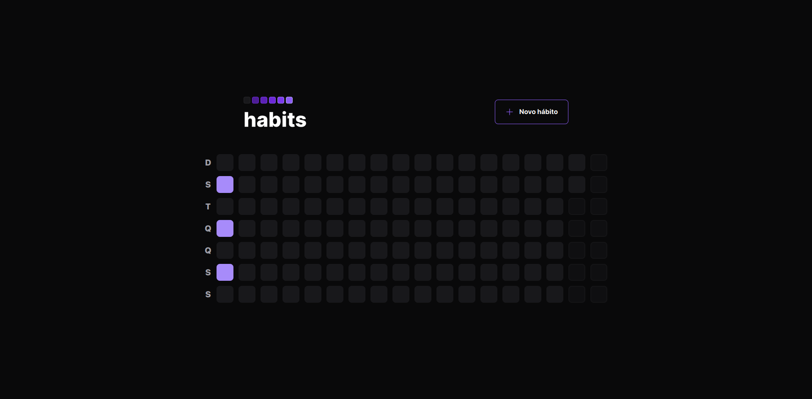
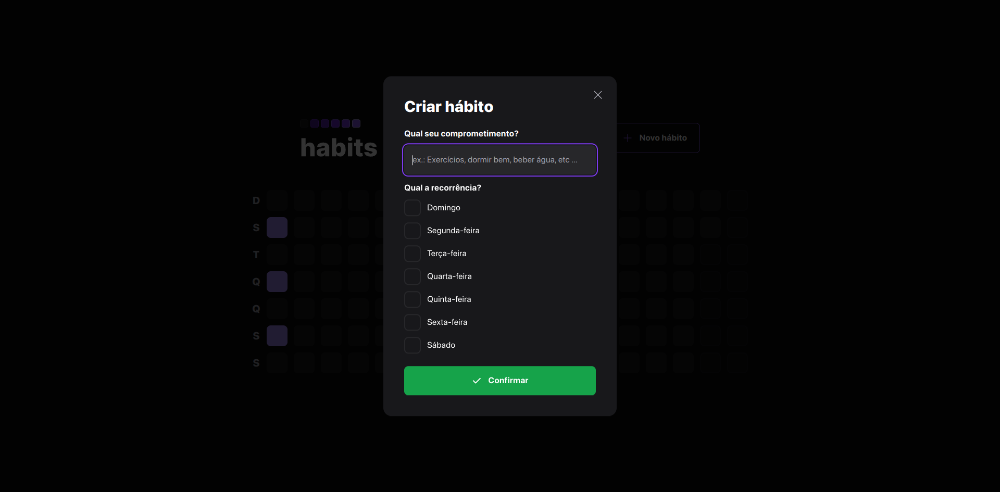
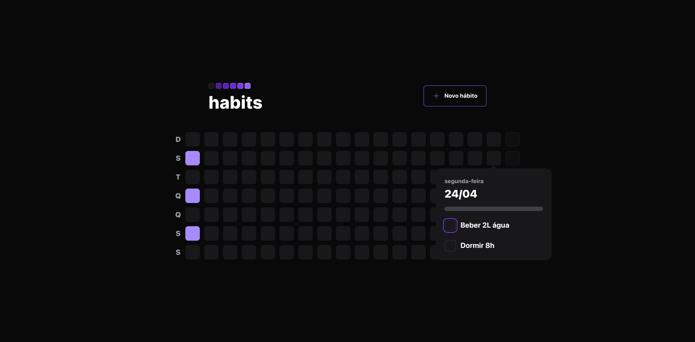
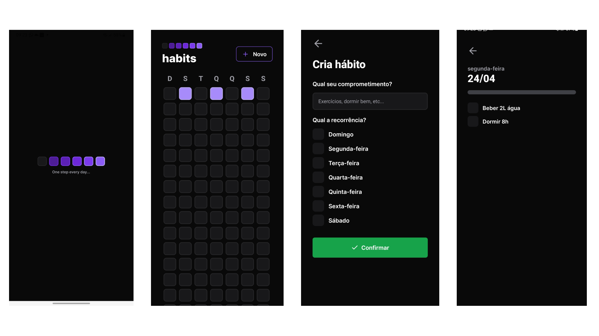

<h1 align="center">
    
</h1>

<div align="center">
    
    
    <a href="https://github.com/einasota/nlw11-setup/commits/main"> 
    
    </a>
    <a href="https://github.com/einasota/nlw11-setup/blob/main/LICENSE.md">
    
    </a>
</div>
<div align="center" > 

[About](#about) | [Technologies](#technologies) | [License](#license)

</div>
 

## About

Habits (NLW Setup) is a project developed during the Next Level Week event on the Ignite track that is produced and organized by [@Rocketseat](https://www.rocketseat.com.br/) where, using a development environment with the JavaScript stack (Typescript, NodeJS, React, React Native, Prisma, Expo, HTML and CSS) where it is shown in practice in a simple and attractive way how an app is developed.

The Application has the functionality to create a task list where it is possible to check, plan, organize and have an overview of how your progress with your tasks is going.

Both in the web and mobile version it is possible:

* Create new habits
* View and complete habit of the day
* See previous days










## Technologies
* [TypeScript](https://www.typescriptlang.org/)
* [NodeJS](https://nodejs.org/en/)
* [ReactJS](https://reactjs.org/)
* [React Native](https://reactnative.dev/)
* [Prisma](https://www.prisma.io/)
* [Expo](https://expo.dev/)

## How To Use
### Requirements

- NodeJS >= 14.17
- yarn or npm

> Use the example Environment Variables files located in the server and mobile folders and rename them to .env

#### Run in all folders (server, web, mobile)
```shell
yarn install
or
npm install
```

#### Run Migration in server folder
```shell
npx prisma migrate dev
```
#### Create games in database
Create using prisma studio in game table
``` shell
npx prisma studio
```
#### Start services (in server, web folders)
```shell
yarn dev
npm run dev
```
#### Start mobile service

```shell
npx expo start
```
### Using the Expo Go
<div>
<h4> Download </h4>
<a href="https://play.google.com/store/apps/details?id=host.exp.exponent&hl=pt_BR&gl=US&pli=1">

</a>
<a href="https://apps.apple.com/br/app/expo-go/id982107779"> 

</a>

</br>

</div>

Use the app to connect and test from your own smartphone. Use the QRCode option in the app and scan the QRCode in the terminal.

### Using the Browser

Use the ip: http://127.0.0.1:3333/

## License
This project is licensed under the MIT license. See the [LICENSE](./LICENSE.md) file for more details.
